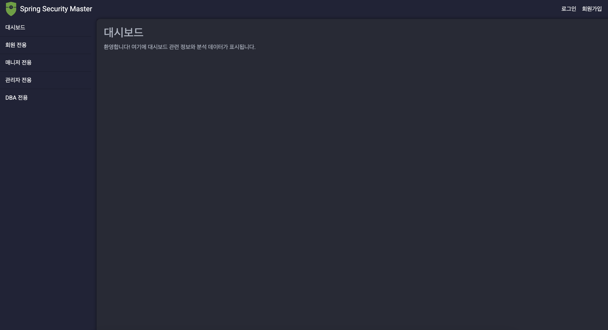
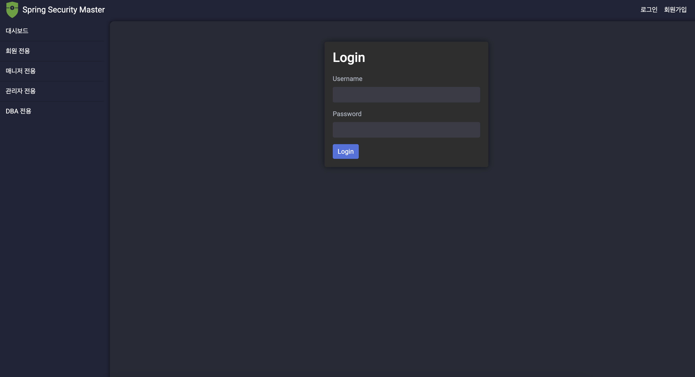
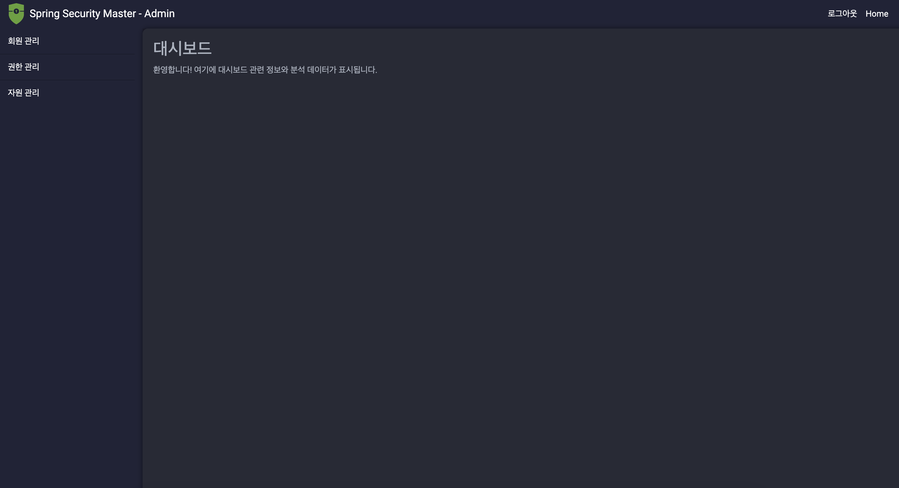
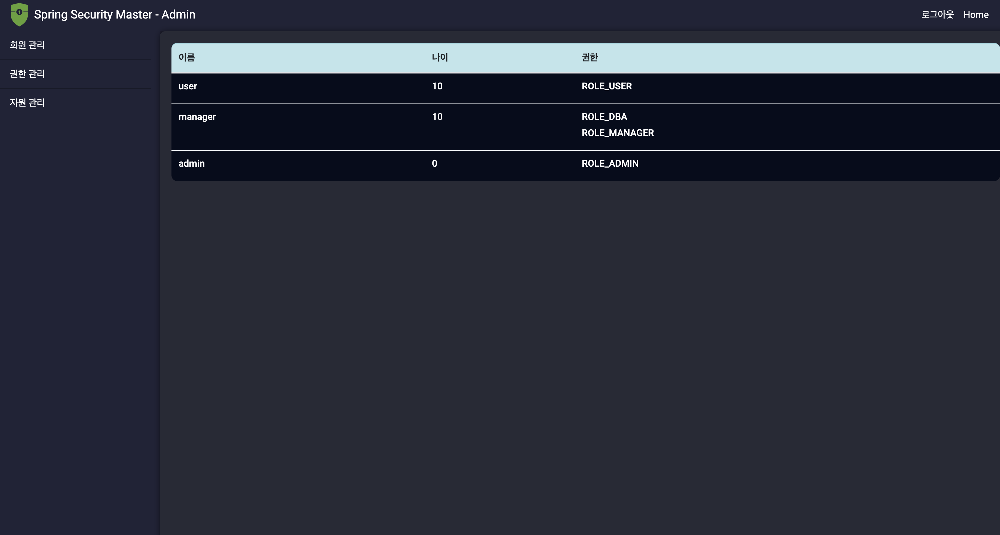
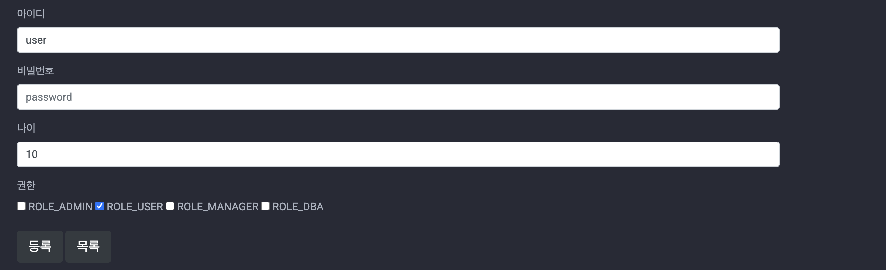
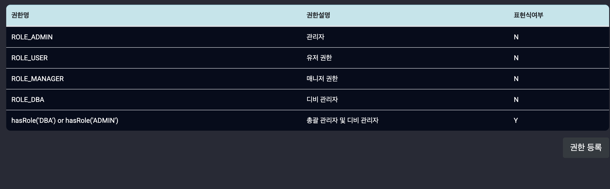
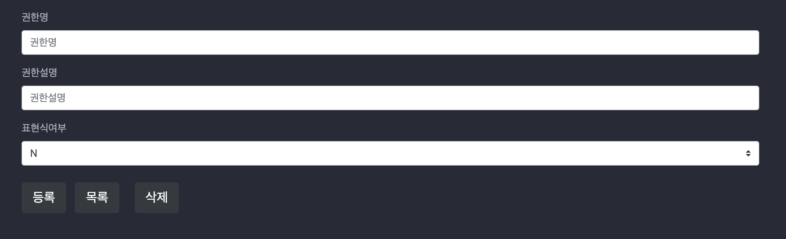
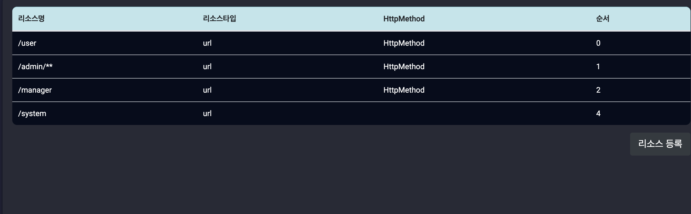
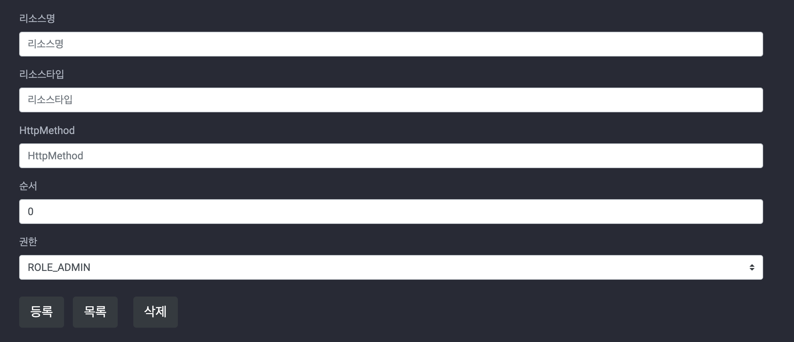

# 스프링 시큐리티 공부 자료

## admin

[SetupDataLoader](/src/main/java/io/security/springsecuritystudy/security/listener/SetupDataLoader.java)클래스를 통해 admin이 자동 생성된다. 
admin의 pw는 pass이다. 이를 통해 관리자 페이지에 접속 할 수 있다.

## 메인 화면

 

## 로그인 화면

 

## 관리자 화면

 

### 회원 관리

 

회원 수정

 

회원의 권한과 나이 비밀번호를 변경할 수 있다.

### 권한 관리

권한 관리 메인 페이지

등록된 모든 권한을 확인할 수 있다.

권한 등록페이지를 통해 직접 새로운 권한을 등록할 수 있다. 
표현식 여부를 선택하면 아래와 같이 직접 표현식을 통해 권한을 설정 할 수 있다. 

> ex) hasRole('DBA') or hasRole('ADMIN')

### 자원 관리

  

처음 설정시 모든 URL에 대해 허용으로 열어두었다. 
그러므로 접근을 제한할 url과 접근에 필요한 권한을 설정할 수 있다.

## 주요 코드 정리

### [SecurityConfig](/src/main/java/io/security/springsecuritystudy/security/configs/SecurityConfig.java)

SecurityConfig에는 스프링 시큐리티에서 사용되는 설정 파일들이 등록되어 있다.

### AuthenticationProvider

[FormAuthenticationProvider](/src/main/java/io/security/springsecuritystudy/security/provider/FormAuthenticationProvider.java)은 AuthenticationProvider를 구현하고 있으며 직접적으로 인증 처리를 수행한다. 
입력된 password값이 올바른 값인지 확인하기 위해 userDetailsService로 부터 Username을 이용해 AccountContext 객체를 가져온 뒤 passwordEncorder를 이용해 디코딩을 수행한 값이 일치한지를 비교한 다음 csrf값까지 확인한 다음 모두 통과가 된다면 UsernamePasswordAuthenticationToken를 전달하게 된다.

### AuthorizatoinManager

[CustomDynamicAuthorizationManager](/src/main/java/io/security/springsecuritystudy/security/manager/CustomDynamicAuthorizationManager.java)를 통해 관한 관리작업을 수행한다.  
여기서는 [PersistentUrlRoleMapper](/src/main/java/io/security/springsecuritystudy/security/mapper/PersistentUrlRoleMapper.java)를 통해 DB를 통해 권한을 동적으로 매핑할 수 있다.

또한 check와 verify를 통해 권한 검사와 확인을 수행한다.

### Hierarchy

[AuthConfig](/src/main/java/io/security/springsecuritystudy/security/configs/AuthConfig.java)에서 [RoleHierarchyServiceImpl](/src/main/java/io/security/springsecuritystudy/admin/service/impl/RoleHierarchyServiceImpl.java)를 설정해 Hierarchy를 사용할 수 있게 되었다. 